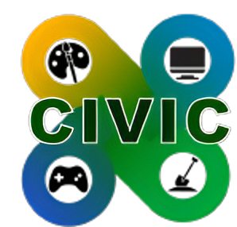

# Welcome To CIVIC
# Creators
A place for creators to innovate together.
### Involve
A place for communities to involve and interact together.
### Value
Value, is the core to every community, just as it’s the core to civic. We value taking care of each other and serving each other.
### Integrate
Integrating people, technologies, and communities.
### Connect
Connecting to others who have skills and expertise in their community.

# What Is CIVIC?
CIVIC is a website where people from a community can collaborate on all fronts. Members or businesses of a community can post events, offer volunteer oppurtunites, post projects they'd like to create and seek help, and much much more!

## Why Is This Needed?
Communities don't have a centralized way to easily communicate with other members of their community about events, help requests, etc. The most widely used workaround are Facebook groups, but a few problems arise with using these. For one, users can post practically anything they want. Additionally, Facebook gives limited control to community organizers. Our website works to eliminate both of these problems, along with many more.

## Features of CIVIC
### Implemented
- Private Profiles
- Feed of All Posts
- Events
- Volunteer Projects
- Creations (Sharing and Asking for Help)
- Calendar of Events
- Accounts
- Post Forums

### Future Implementation
- Feed Filtering
- Public Profiles
- Location Based Accounts
- Seperate Endpoints for Different Communities
- Embeded LinkedIn Information
- More Socials Links
- Embeded Donations / Payment
- Embeded Signup Forms
- Email Lists and Reminders
- AI Chat Bot for Support and Ideation
- Searchable Posts and Members
- Tags for Posts and Members

## Further Plans
- We plan to make the platform more expansive with further options for people to interact in specific areas of interest
- We plan to include local governments so that members of a community may have access to additional resources. Local governments can also share important information to members of their communitiy easily.
- We plan to fully deploy the site either on a server or on a hosting platform such as ```fly.io```

## Technologies Used 
- Django (Frontend & Backend)
- HTML/CSS
- Trix Rich Text Editor
- Calendar JS Widget
- Heroku PostgreSQL
- Choreo (Deployment)

## Links 
- [Demo](https://27b1ccfa-2331-4ded-bfbd-075081cd5ade.e1-us-east-azure.choreoapps.dev/)

- [NE Tech Builders Challenge Pitch Presentation](CIVIC%20Presentation%209-20-25.pdf)

## Contact Info
Email: reaganzierke@gmail.com